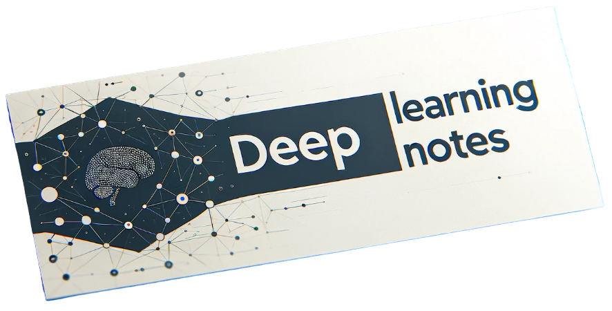

# deep-learning-notes


<p align="center">

<p align="center">


Welcome to the Deep Learning Notes repository! This repository serves as a comprehensive resource for deep learning enthusiasts, providing detailed notebooks, modular implementations, and in-depth analyses related to various aspects of deep learning. Below is the structure and a brief description of each directory within the repository:

## Project Organization

```
├── assets             <- Static files like images and badges.
│
├── automation
│   │
│   └── autogenerate_notebooks_table.py Script that performs the update of the main readme based on
│        notebooks-table-data.csv
│
├── core <- Common utility functions used across notebooks.
│    │
│    ├── __init__.py   <- Makes core a Python module
│    │
│    └── utils.py      <- Useful functions
│
├── notebooks          <- Jupyter notebooks. Naming convention is a short `-` delimited description,
│   │                    e.g. `cross-entropy-loss`.
│   │
│   ├── architectures  <- Implementations of architectures, e.g. UNET.
│   │
│   ├── losses         <- Examples of loss functions, e.g. NLLLoss.
│   │
│   ├── metrics        <- Demonstrations of metrics, e.g. IoU
│   │
│   ├── modules        <- Implementations of a module, e.g. Xception module.
│   │
│   └── data_exploration    <- Exploration of a dataset, e.g. MNIST.
│
├── papers             <- Markdown articles about important deep learning papers.
│
├── CONTRIBUTING.md    <- How to contribute to the project.
│
├── LICENSE            <- Open-source license (MIT)
│
└── README.md          <- Overview of the repository.
```

<!--- AUTOGENERATED-NOTEBOOKS-TABLE -->
<!---
   WARNING: DO NOT EDIT THIS TABLE MANUALLY. IT IS AUTOMATICALLY GENERATED.
   HEAD OVER TO CONTRIBUTING.MD FOR MORE DETAILS ON HOW TO MAKE CHANGES PROPERLY.
-->
## 🏗️ Architectures (8 notebooks)
| **notebook** | **open in colab** | **repository / paper** |
|:------------:|:-----------------:|:----------------------:|
| [Network In Network](https://github.com/semilleroCV/deep-learning-notes/blob/main/notebooks/architectures/network-in-network.ipynb) | [](https://colab.research.google.com/github/semilleroCV/deep-learning-notes/blob/main/notebooks/architectures/network-in-network.ipynb) |  [](https://arxiv.org/abs/1312.4400) |
| [Xception](https://github.com/semilleroCV/deep-learning-notes/blob/main/notebooks/architectures/xception.ipynb) | [](https://colab.research.google.com/github/semilleroCV/deep-learning-notes/blob/main/notebooks/architectures/xception.ipynb) |  [](https://arxiv.org/abs/1610.02357v3) |
| [U-Net](https://github.com/semilleroCV/deep-learning-notes/blob/main/notebooks/architectures/unet.ipynb) | [](https://colab.research.google.com/github/semilleroCV/deep-learning-notes/blob/main/notebooks/architectures/unet.ipynb) |  [](https://arxiv.org/abs/1505.04597) |
| [DenseNet](https://github.com/semilleroCV/deep-learning-notes/blob/main/notebooks/architectures/densenet.ipynb) | [](https://colab.research.google.com/github/semilleroCV/deep-learning-notes/blob/main/notebooks/architectures/densenet.ipynb) |  [](https://arxiv.org/abs/1608.06993v5) |
| [Mobilenet V1](https://github.com/semilleroCV/deep-learning-notes/blob/main/notebooks/architectures/mobilenetv1.ipynb) | [](https://colab.research.google.com/github/semilleroCV/deep-learning-notes/blob/main/notebooks/architectures/mobilenetv1.ipynb) |  [](https://arxiv.org/abs/1704.04861) |
| [Inception V1](https://github.com/semilleroCV/deep-learning-notes/blob/main/notebooks/architectures/inceptionv1.ipynb) | [](https://colab.research.google.com/github/semilleroCV/deep-learning-notes/blob/main/notebooks/architectures/inceptionv1.ipynb) |  [](https://arxiv.org/abs/1409.4842) |
| [MLP Mixer](https://github.com/semilleroCV/deep-learning-notes/blob/main/notebooks/architectures/mlp-mixer.ipynb) | [](https://colab.research.google.com/github/semilleroCV/deep-learning-notes/blob/main/notebooks/architectures/mlp-mixer.ipynb) |  [](https://arxiv.org/abs/2105.01601) |
| [Vision Transformer (ViT)](https://github.com/semilleroCV/deep-learning-notes/blob/main/notebooks/architectures/vit.ipynb) | [](https://colab.research.google.com/github/semilleroCV/deep-learning-notes/blob/main/notebooks/architectures/vit.ipynb) |  [](https://arxiv.org/abs/2010.11929) |
## ❌ Loss Functions (2 notebooks)
| **notebook** | **open in colab** | **repository / paper** |
|:------------:|:-----------------:|:----------------------:|
| [Focal Loss](https://github.com/semilleroCV/deep-learning-notes/blob/main/notebooks/losses/focal-loss.ipynb) | [](https://colab.research.google.com/github/semilleroCV/deep-learning-notes/blob/main/notebooks/losses/focal-loss.ipynb) | [](https://github.com/facebookresearch/Detectron) [](https://arxiv.org/abs/1708.02002) |
| [CELoss vs NLLLoss](https://github.com/semilleroCV/deep-learning-notes/blob/main/notebooks/losses/celoss-vs-nllloss.ipynb) | [](https://colab.research.google.com/github/semilleroCV/deep-learning-notes/blob/main/notebooks/losses/celoss-vs-nllloss.ipynb) |   |
## 📏 Metrics (1 notebooks)
| **notebook** | **open in colab** | **repository / paper** |
|:------------:|:-----------------:|:----------------------:|
| [Intersection Over Union (IoU)](https://github.com/semilleroCV/deep-learning-notes/blob/main/notebooks/metrics/intersection-over-union.ipynb) | [](https://colab.research.google.com/github/semilleroCV/deep-learning-notes/blob/main/notebooks/metrics/intersection-over-union.ipynb) |  [](https://arxiv.org/abs/1902.09630) |
## 🧩 Modules (2 notebooks)
| **notebook** | **open in colab** | **repository / paper** |
|:------------:|:-----------------:|:----------------------:|
| [Pixel Shuffle](https://github.com/semilleroCV/deep-learning-notes/blob/main/notebooks/modules/pixel-shuffle.ipynb) | [](https://colab.research.google.com/github/semilleroCV/deep-learning-notes/blob/main/notebooks/modules/pixel-shuffle.ipynb) |  [](https://arxiv.org/abs/1609.05158) |
| [Multi-Head Attention](https://github.com/semilleroCV/deep-learning-notes/blob/main/notebooks/modules/multihead-self-attention.ipynb) | [](https://colab.research.google.com/github/semilleroCV/deep-learning-notes/blob/main/notebooks/modules/multihead-self-attention.ipynb) |  [](https://arxiv.org/abs/1706.03762) |
## 🔍 Data Exploration (1 notebooks)
| **notebook** | **open in colab** | **repository / paper** |
|:------------:|:-----------------:|:----------------------:|
| [GloVe Word Embeddings](https://github.com/semilleroCV/deep-learning-notes/blob/main/notebooks/data_exploration/glove-word-embeddings.ipynb) | [](https://colab.research.google.com/github/semilleroCV/deep-learning-notes/blob/main/notebooks/data_exploration/glove-word-embeddings.ipynb) | [](https://github.com/stanfordnlp/GloVe) [![NLP Stanford](https://img.shields.io/badge/NLP%20Stanford-white.svg?logo=data:image/png;base64,iVBORw0KGgoAAAANSUhEUgAAAA4AAAAOCAMAAAAolt3jAAAAIGNIUk0AAHomAACAhAAA+gAAAIDoAAB1MAAA6mAAADqYAAAXcJy6UTwAAAFWUExURQAAAP8BAfUBDAAL//oBBp0DaoQEhP8BAf8BAf8BAf8BAf8BAf8BAf8BAf8BAf8BAf8BAf8BAf8BAf8BAf8BAf8BAf8BAf8BAf8BAf8BAf8BAf8BAf8BAf8BAf8BAf8BAf8BAf8BAf8BAf8BAf8BAf8BAf8BAf8BAP8BAP8AAP8BAP8BAP8BAP8BAf8BAP8BAP8BAP8BAIUEg88CNPUBDJIEdoIEhnwEjKMDY9QCL/8BAGsFn4IEhpYEcbkDS7oDSoIEhnsEjYQEhIQEhIQEhH8EiYQEhIQEhIIEhoMEhoQEhIQEhIQEhIQEhIQEhIQEhIQEhIQEhIQEhIQEhIQEhIQEhIQEhIQEhIQEhIQEhIQEhIQEhIQEhIQEhIQEhIQEhIQEhIQEhIQEhIQEhIQEhIQEhIQEhIQEhIQEhIQEhIQEhIQEhIQEhP8BAYQEhIMEhYQEhf///9V885YAAABtdFJOUwAAAAAAAABGnzU7zb8rOdH35vrCmyOc/MMqphIRnjz2rMX+mhed/aWGCCu9/lUSmfyejHhvhWYwuqohCXKm+Jy7N9rDYW0W2fjf92PAcNaV5Pu+1+jy/vFuE/TIgfxpwqJUZefHFQVdfPa//Qot68UbAAAAAWJLR0Rxrwdc4gAAAAd0SU1FB+gICgIZD2E1+A0AAAC9SURBVAjXY2BgYGBkZGTn4ASSDAwQHhd3Lg8vhA8k+fgFBIWEwXwwL1dEVExcQhLMBfJypaRlZMWB8gxMcvzyCopKyirSqmo8nAzM6moamlraOrosevoGhgxGxiamZuYWllbWNrZ29gx5Do5Ozi75rqxu7gUengx5Xt5OPi55vmxu7n7+eQx5eQGBQWBusFdIKEOYe3gekBvBFhkcFR3DEBsXD+SGJSQmJaekpjHEpmdkZrnEhmXH5jnnsAEAzCAlnlJ8kHYAAAAldEVYdGRhdGU6Y3JlYXRlADIwMjQtMDgtMTBUMDI6MjU6MTErMDA6MDBq/u/QAAAAJXRFWHRkYXRlOm1vZGlmeQAyMDI0LTA4LTEwVDAyOjI1OjExKzAwOjAwG6NXbAAAACh0RVh0ZGF0ZTp0aW1lc3RhbXAAMjAyNC0wOC0xMFQwMjoyNToxNSswMDowMLj5UqAAAAAASUVORK5CYII=)](https://nlp.stanford.edu/pubs/glove.pdf) |
<!--- AUTOGENERATED-NOTEBOOKS-TABLE -->

## 🐞 Bugs & 🦸 Contribution

Computer Vision progresses rapidly! Occasionally, our notebooks may lag a little behind the constantly advancing libraries. If you encounter any issues with the functionality of our notebooks, please create a [bug report](https://github.com/semilleroCV/deep-learning-notes/issues/new?assignees=&labels=bug%2Ctriage&projects=&template=bug-report.yml) to inform us.

If you'd like to add a new notebook or improve an existing one, please take a peek at our [contribution guide](https://github.com/semilleroCV/deep-learning-notes/blob/main/CONTRIBUTING.md). There you can find all the information you need.

We are here for you, so don't hesitate to [reach out](https://discord.gg/MkCpdsHZzJ).

## 💻 Run Locally

We try to make it as easy as possible to run our Notebooks in Colab. However, if you prefer to run them locally follow the instructions below. We recommend not to install the dependencies globally, use [virtual environments](https://packaging.python.org/en/latest/guides/installing-using-pip-and-virtual-environments/).

```console
# Clone the repository and navigate to the root directory:
git clone git@github.com:semilleroCV/deep-learning-notes.git
cd deep-learning-notes

# Set up the Python virtual environment and activate it:
python3 -m venv venv
# For Unix-based systems (Linux/Mac)
source venv/bin/activate
# For Windows systems
# venv\Scripts\activate

# (Optional) Install and run jupyter notebook:
pip install notebook
jupyter notebook
```
--------

