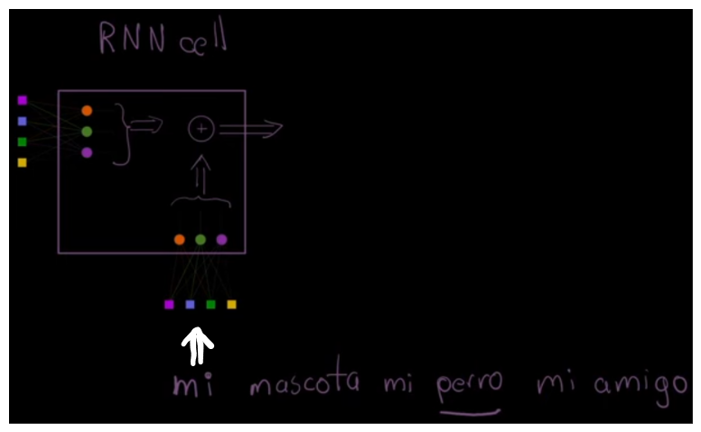
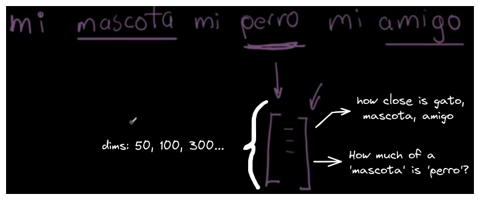
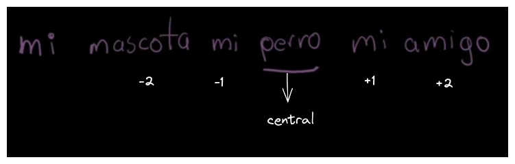
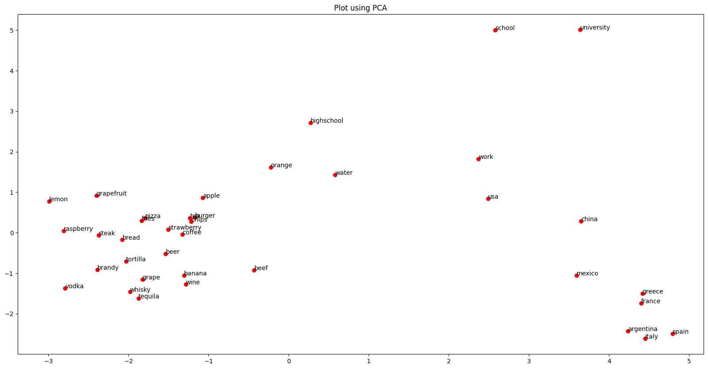
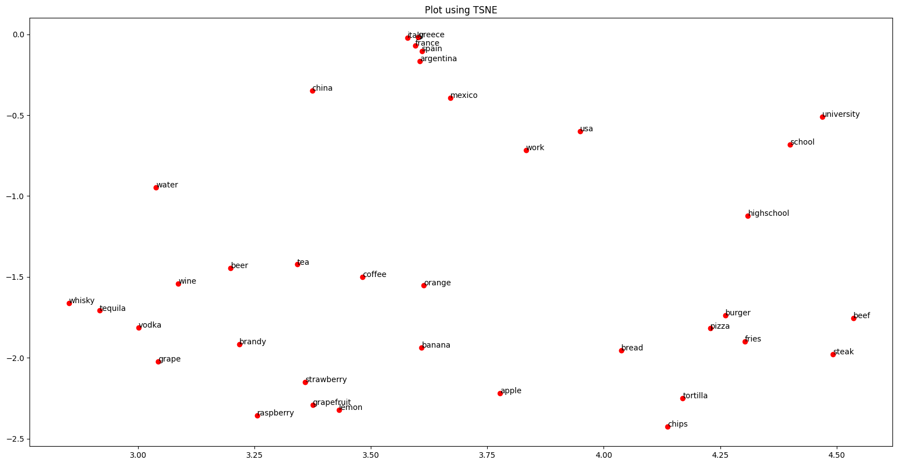

When training a neural network for natural language processing, we need to use words from a vocabulary. However, it is evident that we cannot feed the network with the raw characters of a word. 



This raises the question: how can words be represented computationally? One effective solution to this problem is **word embeddings.**

The topics to be covered in this article are the following:
- What are word embeddings?
- How are they trained?
- How does the model learn?
- Low dimensionality plot of embeddings
- Analogies between embeddings
- Finding the closest words to an embedding

---

## What are word embeddings?

An embedding is a vector of 1xN dimensions that represents the semantic relationship that a word has with other words in the vocabulary.



## How are they trained?

We use a 'window' of size, for example, m=2 and train with articles from Wikipedia.

Our model will find the probability that words from the vocabulary appear in the context (window) of our central word.

In the example: "mi mascota mi perro mi amigo"

The context that our model will search for is: behind, 'mascota' and 'mi', and ahead, 'mi' and 'amigo'.



## How does the model learn?

When training with Wikipedia articles, we know the entire vocabulary, and theoretically, we should know the actual probabilities of words appearing in certain contexts.

Our model aims to minimize the difference or error between the predicted probability of word X appearing in the context of word Y and the actual probability.

In the example "mi mascota mi perro mi amigo", the model minimizes the difference between the predicted probability that "mascota" appears in the context of "perro" and the known actual probability.

This process is repeated for all the words in our vocabulary.

Generally this process of 'training' the embeddings is not done by us but by using pre-trained embeddings, for example from [GloVe.](https://nlp.stanford.edu/projects/glove/) Below is a demonstration of the GloVe embeddings taken from the following [notebook](../notebooks/data_exploration/glove-word-embeddings.ipynb).

## Low dimensionality plot of embeddings

To visualize the embeddings in lower dimensions, we can use the following function:

```python
def plot_embeddings(words2show:list, embeddings_dict:dict=embeddings_dict, fun=PCA):
  embeddings = np.array([embeddings_dict[word] for word in words2show])
  vectors_2d = fun(n_components=2).fit_transform(embeddings)

  plt.figure(figsize=(20, 10))
  plt.scatter(vectors_2d[:, 0], vectors_2d[:, 1], c='red', edgecolors='r')
  for i, word in enumerate(words2show):
    plt.annotate(word, (vectors_2d[i, 0], vectors_2d[i, 1]))
  plt.title(f'Plot using {fun.__name__}')
  plt.show()
```

This function **`plot_embeddings`** takes a list of words (**`words2show`**), a dictionary of embeddings (**`embeddings_dict`**), and a dimensionality reduction function (**`fun`**, such as PCA or TSNE). It reduces the dimensions of the embeddings to 2D and plots them using matplotlib, displaying the words at their corresponding points in the plot.





This helps us to visually recognize how embeddings group words that have a strong semantic relationship, e.g., all countries are close together.

## Analogies between embeddings

To find analogies using word embeddings, we can leverage the relationships captured during the training of the embeddings. For instance, if we have the analogy "man is to king as woman is to ** ??? **," we can use vector arithmetic to find the missing word.

```python
def analogy(word1:str, word2:str, word3:str, embeddings_dict:dict=embeddings_dict):
  embedding_w1 = np.array(embeddings_dict[word1])
  embedding_w2 = np.array(embeddings_dict[word2])
  embedding_w3 = np.array(embeddings_dict[word3])

  new_embedding = (embedding_w2 - embedding_w1) + embedding_w3
  
  max_cosine_sim = -float('inf')
  most_close = ''

  for word in list(embeddings_dict):
    if word not in [word1, word2, word3]:

      # We find the cosine similarity
      cosine_sim = np.dot(new_embedding, embeddings_dict[word]) / (np.linalg.norm(new_embedding) * np.linalg.norm(embeddings_dict[word]))
      if cosine_sim > max_cosine_sim:
        max_cosine_sim = cosine_sim
        most_close = word
    
  return f'{word1} is to {word2} as {word3} is to ** {most_close} **'
```

For example `analogy('mexico', 'mexican', 'spain')` returns `mexico is to mexican as spain is to ** spanish **`

## Finding the closest words to an embedding

We can use cosine similarity to find words that are most similar to a specific one, similar to how analogies are done. The following function finds the 10 words most similar to a given word:

```python
def find_most_similar(word:str, embeddings_dict:dict=embeddings_dict, top_n:int=10):
  if word not in embeddings_dict:
    raise ValueError(f"The word '{word}' is not in the embeddings dictionary.")

  embedding_word = np.array(embeddings_dict[word])

  similarities = {}

  for word_dict in list(embeddings_dict):
    if word_dict != word:
      cosine_sim = np.dot(embedding_word, embeddings_dict[word_dict]) / (np.linalg.norm(embedding_word) * np.linalg.norm(embeddings_dict[word_dict]))
      similarities[word_dict] = cosine_sim

  return sorted(similarities.items(), key=lambda x: x[1], reverse=True)[:top_n]
```

For example `find_most_similar('mexico')` returns `[('mexican', 0.746624160389135),
 ('venezuela', 0.6772869210167971),
 ('colombia', 0.6657630617516543),
 ('peru', 0.6651744341297781),
 ('guatemala', 0.6427802316050415),
 ('argentina', 0.6350952954657274),
 ('brazil', 0.6251765793693822),
 ('chile', 0.6206824530420346),
 ('bolivia', 0.6196904971378979),
 ('america', 0.6157773372240224)]`

## References

Pepe Cantoral, Ph.D. (2023, 26 octubre). ¿Qué son Word EMBEDDINGS? ¡Explorando Embeddings con GloVe y Python! [Vídeo]. YouTube. https://www.youtube.com/watch?v=LagcbjDkqJE

Pennington, J. (s. f.). GloVe: Global Vectors for Word Representation. https://nlp.stanford.edu/projects/glove/