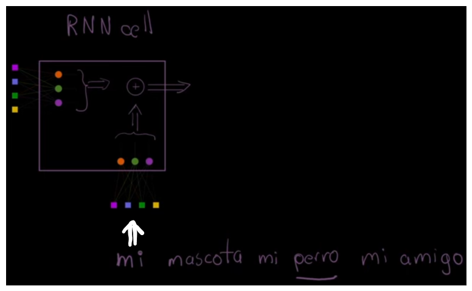
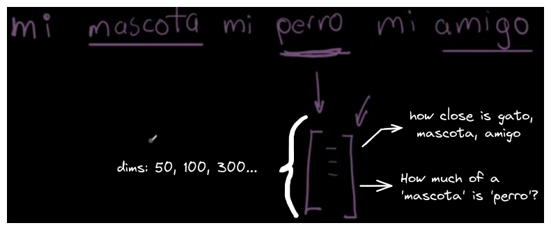
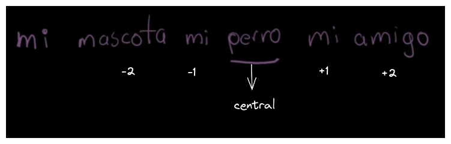

When training a neural network for natural language processing, we need to use words from a vocabulary. However, it is evident that we cannot feed the network with the raw characters of a word. 

This raises the question: how can words be represented computationally? One effective solution to this problem is **word embeddings.**

The topics to be covered in this article are the following:
- What are word embeddings?
- How are they trained?
- How does the model learn?
- Low dimensionality plot of embeddings
- Analogies between embeddings
- Finding the closest words to an embedding

---

## What are word embeddings?

An embedding is a vector of 1xN dimensions that represents the semantic relationship that a word has with other words in the vocabulary.

## How are they trained?

We use a 'window' of size, for example, m=2 and train with articles from Wikipedia.

Our model will find the probability that words from the vocabulary appear in the context (window) of our central word.

In the example: "mi mascota mi perro mi amigo"

The context that our model will search for is: behind, 'mascota' and 'mi', and ahead, 'mi' and 'amigo'.

## How does the model learn?

When training with Wikipedia articles, we know the entire vocabulary, and theoretically, we should know the actual probabilities of words appearing in certain contexts.

Our model aims to minimize the difference or error between the predicted probability of word X appearing in the context of word Y and the actual probability.

In the example "mi mascota mi perro mi amigo", the model minimizes the difference between the predicted probability that "mascota" appears in the context of "perro" and the known actual probability.

This process is repeated for all the words in our vocabulary.

Generally this process of 'training' the embeddings is not done by us but by using pre-trained embeddings, for example from [GloVe.](https://nlp.stanford.edu/projects/glove/) Below is a demonstration of the GloVe embeddings taken from the following [notebook](../notebooks/data_exploration/glove-word-embeddings.ipynb).

## Low dimensionality plot of embeddings
## Analogies between embeddings
## Finding the closest words to an embedding

## References

Pepe Cantoral, Ph.D. (2023, 26 octubre). ¿Qué son Word EMBEDDINGS? ¡Explorando Embeddings con GloVe y Python! [Vídeo]. YouTube. https://www.youtube.com/watch?v=LagcbjDkqJE

Pennington, J. (s. f.). GloVe: Global Vectors for Word Representation. https://nlp.stanford.edu/projects/glove/